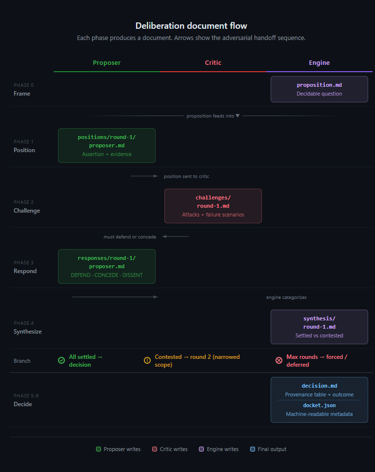

# Delphi

**Structured multi-agent deliberation for Claude Code.**

When you ask an AI a design question, you get one opinion. `delphi` gives you a structured adversarial process: one agent proposes, another attacks, the proposer must defend with evidence or concede. The result is a decision document with full provenance — not a single-pass answer, but a stress-tested recommendation you can actually trust.

```
/delphi "Should we use event sourcing or CRUD for the order pipeline?"
```

That's it. Two agents argue. Challenges must be addressed with citations or concessions. You get a ratified decision with a provenance table showing exactly which claims survived scrutiny and which didn't.

---

## Concept

Delphi is a lightweight implementation of the [Democracy of AI](https://stolenfire.dev/posts/democracy-of-ai-deliberative-consensus) — a deliberative consensus framework that applies parliamentary institutional design to AI decision-making. Where single-model generation produces decisions filtered through one analytical framework, structured adversarial deliberation forces assumptions into the open, challenges comfortable consensus, and produces decisions with full provenance.

The pattern has roots in the [Delphi method (RAND, 1950s)](docs/delphi-lineage.md) and structured analytic techniques from the intelligence community, but extends them with formal convergence rules, documented dissent, human deferral, and adversarial challenge as a structural requirement rather than an optional practice.

Solo AI conversations have a well-documented failure mode: **evaluator leniency**. When the same model generates and evaluates, it tends to agree with itself. Uncomfortable truths get softened. Edge cases get hand-waved. `delphi` solves this architecturally — the critic's mandate is `challenge_all`, defenses require citations, and the engine categorizes outcomes by structural markers, not argument quality. There is no room for politeness to override rigor.

---

## What it generates

Every deliberation produces a **docket** — a complete, auditable record:

```
.deliberation/dockets/20260324-143022-event-sourcing-vs-crud/
  proposition.md              # The decidable question
  positions/round-1/
    proposer.md               # Initial position with evidence
  challenges/
    round-1.md                # Adversarial challenges
  responses/round-1/
    proposer.md               # Defend / Concede / Dissent for each challenge
  synthesis/
    round-1.md                # Engine categorization: settled vs contested
  decision.md                 # Final decision with provenance table
  docket.json                 # Machine-readable metadata
```

The **decision document** includes:

| Decision | Proposed by | Challenged by | Resolution |
|----------|-------------|---------------|------------|
| Use event sourcing for order state | proposer | critic | DEFEND — cited benchmark data |
| Skip CQRS read model initially | proposer | critic | CONCEDE — added read model to phase 2 |

Every claim traces back to who said it, who challenged it, and how it was resolved. No black boxes.

---

## Reading the output



**The adversarial handoff.** Documents flow between three actors. The proposer writes a position with evidence. The critic attacks it — weakest claim, untested assumption, concrete failure scenario. The proposer must respond to every challenge with exactly one action: defend (with a citation), concede, or record dissent.

**The round loop.** After each exchange, the engine categorizes outcomes by structural markers — not argument quality. A defense without a citation is "contested" regardless of how persuasive it sounds. If contested points remain and rounds are left, the scope narrows and another round begins. Settled points are locked and never revisited.

**Tracing a decision.** Every row in the provenance table in `decision.md` maps back through this chain: who proposed it, who challenged it, and how it was resolved. The docket directory is the permanent record — the conversation output is just the summary.

---

## Installation

### From the marketplace

```bash
claude plugin add stolen-fire/delphi
```

### From a local clone

```bash
git clone https://github.com/stolen-fire/delphi.git
claude --plugin-dir ./delphi
```

No dependencies. No build step. The plugin is pure markdown and YAML — Claude Code's subagent system handles all execution.

---

## Usage

### Quick deliberation

Ask any design question inline:

```
/delphi "Should we use Redis or Postgres for session storage?"
```

This runs **lightweight mode**: a proposer and a critic, up to 2 rounds, with a decision or forced outcome at the end.

Add `--tone` to any invocation for a different voice:

```
/delphi --tone snarky "Should we use Redis or Postgres for session storage?"
```

### Custom composition

Define your own deliberation roster in YAML:

```
/delphi --config compositions/integration-review.yml --input api-spec.md
```

Compositions let you configure delegates, capabilities, round limits, and rules like veto power or human deferral.

### Dry run

Preview the deliberation setup without executing:

```
/delphi --dry-run --config compositions/integration-review.yml
```

### Build a custom composition

Create a tailored deliberation panel through a guided interview:

```
/delphi-compose
```

The command asks about your decision, what's at risk, and any context files — then proposes a panel of delegates, generates the composition YAML, and optionally runs the deliberation immediately.

---

## Two modes

### Lightweight

Two delegates — proposer and critic — in a sequential adversarial exchange. The engine handles framing and synthesis directly. Fast, focused, good for most design decisions.

- 2 delegates (proposer + critic)
- Up to 2 rounds
- Engine writes the decision directly

### Standard

Multiple delegates with independent positions, a Chair agent for procedural facilitation, veto mechanics, and human deferral for genuinely undecidable questions.

- 3-5 delegates dispatched in parallel (anti-anchoring by design)
- Chair agent frames propositions and writes ratified decisions
- Veto power for domain invariant violations
- Human deferral when consensus is unreachable — produces a structured options package, not a cop-out

---

## The protocol

Every deliberation follows a six-phase protocol:

**Phase 0 — Initialization.** Create a docket directory. Frame the user's question as a decidable proposition.

**Phase 1 — Position.** The proposer writes a position statement: direct assertion, evidence with `[CITE:]` markers, risks, anticipated counterarguments.

**Phase 2 — Challenge.** The critic attacks: weakest claim, untested assumption, concrete failure scenario. No diplomatic softening.

**Phase 3 — Response.** The proposer must address every challenge with exactly one action:
- `[ACTION: DEFEND]` — refute with evidence (citation required)
- `[ACTION: CONCEDE]` — accept and update position
- `[ACTION: DISSENT]` — accept but record concern for the record

**Phase 4 — Synthesis.** The engine categorizes each exchange by structural markers — not argument quality. A defense without a citation is classified as *contested*, regardless of how persuasive it sounds.

**Phase 5 — Decision.** If all points are settled: ratified. If contested points remain: another round (up to the limit) or terminal outcome.

**Phase 6 — Docket finalization.** Write `decision.md`, `docket.json`, and any dissent records.

---

## Compositions

Compositions are YAML files that define the deliberation roster and rules. Two are included:

### `quick-review.yml` (lightweight)

```yaml
delegates:
  - role: proposer
  - role: critic
    capabilities: [challenge_all]

rules:
  max_rounds: 2
  require_dissent_record: true
```

### `integration-review.yml` (standard)

A four-delegate composition with a domain architect who can veto invariant violations, a frontend advocate, and an integration realist whose job is to manufacture failure scenarios:

```yaml
delegates:
  - role: chair
    capabilities: [frame_propositions]
  - role: domain_architect
    capabilities: [veto_invariant_violations]
  - role: frontend_advocate
  - role: integration_realist
    capabilities: [challenge_all]

rules:
  max_rounds: 3
  independent_positions: true    # Anti-anchoring: delegates can't see each other
  human_deferral: true           # Deadlocks produce a structured options package
  veto_roles: [domain_architect]
```

Write your own compositions for your domain. Define the roles, assign capabilities, set the rules.

---

## Tones

Tones control how delegates *say* things without changing *what* they argue. Add `tone:` to any composition to change the deliberation voice:

```yaml
name: my-review
mode: standard
tone: parliamentary

delegates:
  # ...
```

### Built-in tones

| Tone | Voice |
| ------ | ------- |
| `snarky` | Chesterton meets on-call engineer. Sharp truths grounded in consequences — "This is who gets paged at 3 AM." |
| `diplomatic` | Steel-man before you critique. Measured precision, professional warmth, no hedging. |
| `adversarial` | Courtroom cross-examination. No pleasantries. Every claim is guilty until proven innocent. |
| `socratic` | Questions that corner you into your own answer. Never states what it can ask. |
| `parliamentary` | Monty Python's Holy Grail as British Parliament. The honourable members deliberate with coconut-based migration analogies and increasing procedural desperation. |

`/delphi-compose` offers tone selection during the guided interview. Or set it directly in YAML.

### Custom tones

Drop a markdown file in your project at `.claude/delphi/tones/{name}.md`:

```markdown
---
name: pirate
description: Arr, every design decision be a voyage into uncharted waters
---

## Voice directive

{Instructions for how delegates should write}

## Examples

### Before (neutral)
> {Neutral deliberation output}

### After (pirate)
> {Same content in pirate voice}
```

Your custom tone appears automatically in `/delphi-compose` and is available via `tone: pirate` in any composition.

---

## Evidence & verification

For deliberations involving source documents, Delphi provides an evidence pipeline and verification capabilities.

### Evidence submission

```bash
/delphi --config comp.yml --evidence ./documents/
```

Source files (PDFs, DOCX, text) are converted to searchable text with per-file provenance tracking. An evidence index records conversion method (born-digital vs. OCR), confidence level, and SHA-256 hashes for reproducibility.

### Capabilities

| Capability | Role | Timing | Purpose |
|---|---|---|---|
| `frame_propositions` | Chair | Proposition + decision | Precise framing, synthesis quality |
| `challenge_all` | Adversarial | Challenge phase | Mandatory challenges |
| `veto_invariant_violations` | Domain expert | Response phase | Correctness constraints |
| `research_authority` | Specialist | Pre-deliberation + recovery | Case law appendix with verified absences |
| `verify_sources` | Auditor | Challenge/response phases | Factual verification with coverage map |

### Verification coverage

The engine tracks which factual claims were independently verified and which were not. The decision document includes a coverage summary showing verification depth — epistemic honesty about what was checked vs. what delegates asserted without independent verification.

---

## When to use it

Architecture decisions are the obvious use case, but deliberation applies anywhere you'd want a second opinion before committing: **debugging** (force adversarial hypothesis testing instead of confirmation bias), **pre-merge review** (is the approach sound, not just the code), **incident post-mortems**, **migration strategy**, **dependency decisions**, **RFC review**, and more.

See **[docs/use-cases.md](docs/use-cases.md)** for the full range of scenarios with example commands.

---

## Design choices

**Structural markers over subjective judgment.** The engine never evaluates whether an argument is "good." It checks: did the defense include a citation? Was an action tag present? This makes synthesis deterministic and auditable.

**Anti-anchoring in standard mode.** Delegates are dispatched in parallel with isolated context windows. They literally cannot see each other's positions. This prevents the first responder from anchoring the entire deliberation.

**Forced outcomes over infinite loops.** If consensus isn't reached after max rounds, the proposer's position wins (lightweight) or the question is deferred to the human with a structured options package (standard). No deliberation runs forever.

**Docket-as-artifact.** The docket directory is the permanent record. The conversation output is just the summary. You can review, diff, or re-examine any deliberation after the fact.

---

## Background & further reading

- [The Democracy of AI](https://stolenfire.dev/posts/democracy-of-ai-deliberative-consensus) — The conceptual framework behind this plugin. Parliamentary institutional design applied to AI decision-making.
- [Harness design for long-running application development](https://www.anthropic.com/engineering/harness-design-long-running-apps) — Anthropic's empirical findings on multi-agent harness design. Their generator/evaluator separation and file-based communication patterns informed this plugin's architecture.

---

## License

MIT
